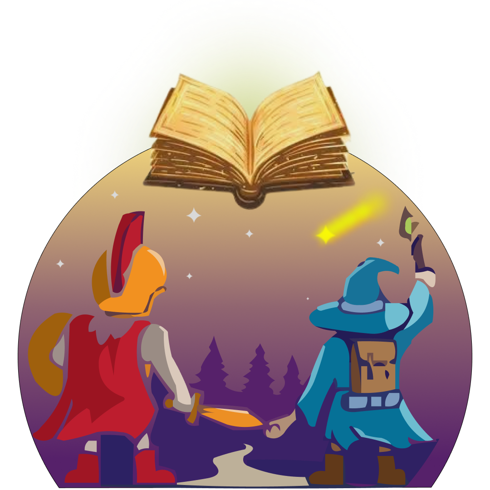

  

# ✨ Eldoria
*A 2D collaborative board game experience*

---

## 🧭 Overview  
Eldoria is a 2D cooperative board game built in Unity, designed for both adults and kids. Players journey through magical biomes and realms, answering questions, solving puzzles, and collaborating to survive challenges in a mystical world. Whether exploring for fun or reflection, Eldoria encourages teamwork, strategy, and emotional intelligence.

---

## 👥 Game Modes & Collaboration  
- **🎲 Players**: 2–4 players  
- **🧠 Modes**:  
  - *Kids*: Simplified puzzles and challenges  
  - *Adults*: Full question bank and puzzle difficulty  
- **💗 Collaboration**:  
  - Share items and health (hearts)  
  - Strategize movement and tile decisions together  
  - Team wins or loses together  

---

## 🧩 Core Mechanics  
- Turn-based movement using 2 dice (up to 3 with a special item)  
- **Diverse tile types**:  
  - ❓ Question Tile  
  - 🧩 Puzzle Tile  
  - ⚠️ Penalty Tile  
  - 🌀 Teleport  
  - 🎯 Finish (Capital trigger)  
- **Inventory System**:  
  - Potions, bonus dice, and more  
  - Use and exchange items with teammates  
- **Health System**:  
  - 3 or 4 hearts per player (based on player count)  
  - If any player reaches 0, all lose  

---

## 🌍 World Layout  
Eldoria unfolds across **5 unique biomes** and the final Capital:  

### Biomes:
- **🌳 Forest**: Navigate winding paths and collaborate at the **Mother Tree** (special event).  
- **🏡 Village**: Trade resources and solve community-based puzzles.  
- 🏖️ **Beach**: Avoid tidal traps and decode sand-script riddles.  
- 🌋 **Volcano**: Dodge lava flows and balance risk-reward challenges.  
- ❄️ **Snow**: Survive blizzards and icy sliding puzzles.  

### 🏛️ Capital (Final Area):  
- Solve **riddles** to unlock the Temple of Victory.  
  - Example riddle: *"I speak without a mouth and hear without ears. What am I?"*  
- Players carry progress (health, inventory) from earlier biomes.  
- **Mother Tree Event**: A collaborative puzzle in the Forest biome where players answer philosophical questions to gain blessings .  

---

## 🎯 Win & Loss Conditions  
- **🏆 Victory**: Solve the final riddle in the Capital's Temple of Victory.  
- **💀 Defeat**: If any player loses all hearts, the entire team fails.  

---

## 🔉 Audio & Feedback  
- Custom music for menu and maps (made in FL Studio).  
- Click SFX, question feedback, scroll panels, buffs, and more.  
- All audio organized via a global AudioManager system.  

---

## 🛠️ Tech Stack  
- **🎮 Engine**: Unity 2022.3 LTS  
- **💻 Code**: C# in Visual Studio & VS Code  
- **🎵 Audio**: FL Studio, MuseScore  
- **🎨 Art**: Pixel-based (Aseprite-style tilesets & assets)  

---

## 📚 Profiles & Progress  
- Persistent player profiles with:  
  - Elo difficulty system  
  - Question category stats  
  - Visual customization  

---

## 🔐 License  
All code, art, and assets are the property of the Eldoria development team.  
*For internal and educational use only. Redistribution or commercial use is prohibited.*
